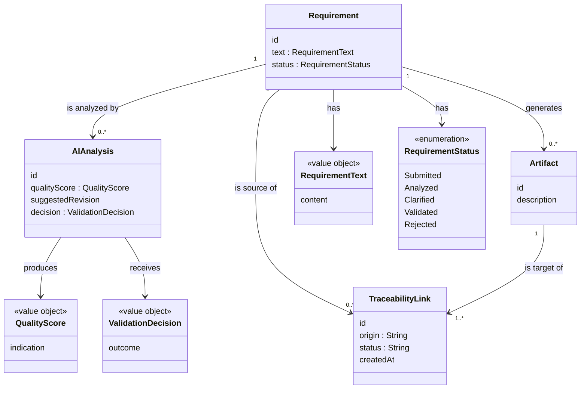

# BridgeIT — Domain Model

**Status:** Preliminary — subject to refinement during implementation (see [Design Decisions and Future Refinements](#design-decisions-and-future-refinements))

---

## Why Domain Modeling Matters in Domain-Driven Design

Domain-Driven Design starts from the premise that the software's internal structure should reflect the concepts and rules of the problem domain it serves, not the technical mechanisms used to store or transport data. For a Requirements Engineering platform such as BridgeIT, this distinction is particularly important: the domain is not "records in a database" but a set of concepts — a requirement, its quality, its validation, the artifacts derived from it — that have meaning independently of any specific persistence technology, web framework, or AI provider.

Modeling the domain explicitly, before writing implementation code, serves several purposes that are directly relevant to BridgeIT's architectural constraints:

- It gives the Hexagonal Architecture's inner layer (the domain) a concrete shape to protect — see [architecture.md](architecture.md) for how this domain model is positioned within the platform's ports-and-adapters structure. Ports and adapters only make sense once there is a domain worth isolating from infrastructure concerns.
- It makes the platform's core commitment — that AI suggests, and humans validate — expressible as an explicit domain rule, rather than an implicit convention scattered across application code.
- It provides a shared vocabulary (a ubiquitous language, in DDD terms) that this document, the codebase, and future Architecture Decision Records can all refer to consistently.
- It allows business rules such as "an artifact cannot exist without a validated requirement" to be reasoned about and reviewed before any implementation decision is made, reducing the risk of the domain being distorted by early technical choices.

The model presented below is intentionally conceptual. It identifies entities, value objects, and rules; it does not yet commit to class definitions, method signatures, or storage schemas, all of which belong to later, implementation-focused documentation.

### Ubiquitous Language

The terms below form the project's ubiquitous language and are used with the same meaning in this document, [report.md](report.md), and [architecture.md](architecture.md). Capitalized names refer to the specific domain concept defined here; lowercase use of the same words in ordinary prose refers to the general English meaning, not the formal concept.

| Term | Meaning | Elaborated in |
|---|---|---|
| **Requirement** | A natural-language statement of intent managed through its lifecycle within BridgeIT; the aggregate root of the domain model. | This document — [Requirement](#requirement) |
| **Artifact** | A structured, engineering-facing object derived from a validated Requirement. | This document — [Artifact](#artifact) |
| **AI Analysis** | The outcome of an AI-assisted evaluation of a Requirement, held as a proposal pending human review. | This document — [AI Analysis](#ai-analysis) |
| **Traceability Link** | An explicit, inspectable relationship connecting a Requirement to something derived from it. | This document — [Traceability Link](#traceability-link) |
| **Quality Indication** | A non-binding assessment of a Requirement's clarity, completeness, and freedom from ambiguity, produced by an AI Analysis. Modeled here as `QualityScore`. | This document — [QualityScore](#qualityscore) |
| **AI Gateway** | The architectural abstraction boundary between the application layer and any external AI provider. | [architecture.md — AI Architecture](architecture.md#ai-architecture) |
| **Human Validation** | The mandatory human decision (approve, edit, or reject) required before an AI-generated suggestion can affect authoritative project data. | [report.md — AI Philosophy](report.md#ai-philosophy); modeled here as `ValidationDecision` |
| **Hexagonal Architecture** | The Ports-and-Adapters architectural style isolating domain logic from infrastructure. | [architecture.md — Architectural Principles](architecture.md#architectural-principles) |
| **Domain-Driven Design** | The design approach organizing the system around this explicit domain model rather than technical structures. | This document, in full |

---

## Domain Entities

An entity is a domain object defined primarily by its identity and its lifecycle, rather than by the specific values of its attributes at any given moment. Two instances of an entity with identical attribute values are still considered distinct if their identities differ, and a single entity instance can change its attributes over time while remaining "the same" object.

### Requirement

**Purpose:** Represents a single unit of business or system intent, originally expressed in natural language, that the platform manages through its lifecycle from submission to validation.

**Responsibility:** Acts as the aggregate root of the domain model (see [Aggregate Boundary](#aggregate-boundary) for the rationale). It is responsible for holding its own current text and status, and for exposing enough information to determine whether it is eligible for the next step in its lifecycle (e.g., whether it can be analyzed, or whether it can be used to generate an artifact).

**Main attributes (conceptual):**
- A unique identity, distinguishing this requirement from any other.
- Its current text (see the `RequirementText` value object).
- Its current status (see the `RequirementStatus` value object).
- A reference to the point in time it was originally submitted.

**Possible lifecycle / state transitions:**
`Submitted → Analyzed → Clarified (optional, may loop back to Analyzed) → Validated → (eligible for Artifact creation)`

A requirement may also be explicitly **Rejected** at the validation step, in which case it does not proceed to artifact generation. The exact set of states is expected to be refined once the [Requirements Engineering Workflow](report.md#requirements-engineering-workflow) is implemented in code; the sequence above reflects the workflow already described in the project's documentation.

The exact relationship between an individual AI Analysis's `ValidationDecision` (FR-05) and the Requirement's own transition into the `Validated` status is intentionally left open at this stage — for instance, whether approving one AI Analysis is sufficient, or whether validation is a separate, explicit action a human takes once satisfied with a Requirement overall. This document does not commit to either design; the decision will be finalized once the application layer's use cases for FR-05 and the Requirement lifecycle are implemented.

**Relationships with other entities:** A Requirement may be associated with zero or more AI Analysis instances (each analysis is performed *on* a requirement), zero or more Artifacts (each derived *from* a requirement), and zero or more Traceability Links (each connecting the requirement to something derived from it).

---

### Artifact

**Purpose:** Represents a structured, engineering-facing object derived from a validated requirement, intended to be consumed by software engineers rather than business stakeholders. Depending on how a given project or team chooses to work, a Derived Artifact might eventually take the shape of, for example, a **User Story**, a set of **Acceptance Criteria**, or a **Development Task**. These are illustrative examples of what an Artifact could represent, not a commitment to any of them: BridgeIT currently treats "Artifact" as a single, general concept, and does not yet distinguish between different kinds of derived artifact (see [Modeling Assumptions and Boundaries](#modeling-assumptions-and-boundaries)).

**Responsibility:** Captures the structured output of the transformation BridgeIT exists to support — turning validated natural-language intent into something an engineering team can act on — while preserving the connection back to its origin.

**Main attributes (conceptual):**
- A unique identity.
- A structured description (the specific shape of this description is intentionally left undefined at this stage — whether it eventually resembles a User Story's narrative format, a checklist of Acceptance Criteria, or a Development Task's implementation-facing description depends on decisions not yet made about what kinds of derived artifacts BridgeIT will support).
- A reference to the requirement it was derived from.

**Possible lifecycle / state transitions:** At this stage, an Artifact is expected to have a simpler lifecycle than a Requirement — conceptually, `Created → (available for downstream consumption)`. Whether an Artifact requires its own independent lifecycle (e.g., stages of engineering progress) is left open, since the current [Scope](report.md#scope) of the project focuses on the transformation and traceability of requirements, not on managing engineering delivery itself.

**Relationships with other entities:** An Artifact always originates from exactly one Requirement, and it is the target of at least one Traceability Link (the one connecting it to its source requirement).

---

### AI Analysis

**Purpose:** Represents the outcome of an AI-assisted evaluation performed on a Requirement's text — for example, an assessment of ambiguity or completeness — together with any suggestion the AI produced.

**Responsibility:** Holds the AI's output as a distinct, inspectable domain object, separate from the Requirement itself. This separation is what allows BridgeIT to enforce, at the domain level, that an AI Analysis is a proposal to be reviewed rather than a change directly applied to a Requirement.

**Main attributes (conceptual):**
- A unique identity.
- A reference to the Requirement it was performed on.
- A resulting quality assessment (see the `QualityScore` value object).
- Any suggested revision produced by the analysis.
- The human decision made in response to it, once available, including a reference to who made it (see the `ValidationDecision` value object).

**Possible lifecycle / state transitions:** Conceptually, `Produced → Reviewed`, where "Reviewed" reflects that a human has recorded a `ValidationDecision` in response to it. An AI Analysis is not expected to change once produced; what changes is whether a decision has been recorded in relation to it.

**Relationships with other entities:** An AI Analysis always relates to exactly one Requirement (the one it was performed on). It does not directly relate to an Artifact or a Traceability Link; its influence on those, if any, is mediated entirely through a human validation decision acting on the Requirement.

---

### Traceability Link

**Purpose:** Represents an explicit, inspectable relationship between a Requirement and something derived from it — most concretely, an Artifact — so that the origin of any derived object can always be established.

**Responsibility:** Exists specifically to make traceability a first-class, queryable domain concept, rather than an implicit consequence of how data happens to be stored. Its sole reason for existing is to answer questions such as "what was this artifact derived from?" and "what has been derived from this requirement?".

**Main attributes (conceptual):**
- A unique identity.
- A reference to the **source Requirement**.
- A reference to the **target Artifact** (or another derived object, in the future).
- Its **origin** — whether it was proposed by an AI Analysis or created directly by a human — reflecting the platform's AI philosophy that AI-originated relationships must remain distinguishable and subject to confirmation.
- Its current **lifecycle status** (`Proposed` or `Confirmed`; see below).
- The **creation timestamp** — the point in time the link was first proposed or created.

**Possible lifecycle / state transitions:** Conceptually, a Traceability Link is either `Proposed` (if suggested by AI analysis, pending confirmation) or `Confirmed` (once a human has validated it). A rejected proposal does not become a Traceability Link at all — it simply does not proceed past the proposal stage.

**Relationships with other entities:** A Traceability Link always connects exactly one Requirement to exactly one derived object (currently, an Artifact). It is the domain's explicit representation of the relationship informally described elsewhere in this document as "Requirement → Artifact."

---

## Value Objects

A value object is a domain object defined entirely by the combination of its attribute values, with no identity of its own. Two value objects with the same attributes are considered equal and interchangeable; a value object is typically immutable, and "changing" it conceptually means replacing it with a new one rather than mutating it in place.

### RequirementText

**Why it should be modeled as a value object:** The text of a requirement, at a given point in its history, is fully described by its content. Two requirements that happen to contain identical text are not "the same text" because they share an identity — the text itself has no identity to begin with. What has identity is the Requirement entity that currently holds a given `RequirementText`.

**What distinguishes it from an entity:** It is immutable — clarifying a requirement (FR-03) does not modify a `RequirementText` in place; it replaces the Requirement's current text with a new `RequirementText` value. This immutability is what allows the history of how a requirement's wording evolved to be represented cleanly, without ambiguity about "which version" a given text belongs to.

### QualityScore

**Why it should be modeled as a value object:** A quality assessment is meaningful purely through its value (e.g., the specific combination of clarity, completeness, or ambiguity indications it represents) and has no independent existence or identity separate from the AI Analysis that produced it.

**What distinguishes it from an entity:** It cannot be meaningfully "edited" — a new analysis produces a new `QualityScore` rather than modifying a previous one. This mirrors the platform's [AI Philosophy](report.md#ai-philosophy): an AI-produced quality assessment is a snapshot, not a living object requiring identity tracking of its own.

### ValidationDecision

**Why it should be modeled as a value object:** A validation decision (approve, edit, or reject, per FR-05) is defined completely by what was decided and does not need to be tracked, referenced, or changed independently of the AI Analysis or Traceability Link proposal it responds to.

**What distinguishes it from an entity:** It is a record of a discrete human judgment at a point in time. It is not expected to change after the fact — if a human reconsiders, the domain rule is that a new decision is recorded, not that the previous one is edited, preserving an honest history of how validation actually occurred.

**Note on attribution:** FR-05's acceptance criteria require that a validation decision be "recorded and attributable." `ValidationDecision` is therefore expected to reference who made the decision. This document does not define how that reference is represented (e.g., as a full user/identity entity), since no functional requirement currently covers user identity or authentication; the concept is acknowledged here at a minimal, conceptual level and will be resolved once identity management is scoped.

### RequirementStatus

**Why it should be modeled as a value object:** The status of a requirement (e.g., Submitted, Analyzed, Validated) is fully defined by which state it represents; it carries no identity beyond that value, and two requirements in the same status share exactly the same status value.

**What distinguishes it from an entity:** It is replaced wholesale as a Requirement transitions through its lifecycle, rather than being modified incrementally. Modeling it as a value object keeps the Requirement entity responsible for its own transitions, while keeping the representation of "what state is this" simple and comparable by value.

---

## Domain Rules

The following rules are expected to be enforced by the domain and application layers, independent of any specific infrastructure or delivery mechanism. They translate the project report's Functional Requirements and AI Philosophy into explicit domain constraints:

- **A requirement must exist before an artifact can be created.** An Artifact is only meaningful in relation to a source Requirement; the domain does not permit an Artifact to be created without a reference to the Requirement it derives from (FR-07).
- **AI suggestions cannot automatically modify authoritative requirement data.** An AI Analysis is a standalone object describing a proposed assessment or revision; applying it to a Requirement's authoritative text or status requires an explicit `ValidationDecision` (FR-02, FR-05).
- **Every AI-generated suggestion must remain traceable to the original requirement.** Every AI Analysis and every AI-proposed Traceability Link carries an explicit reference back to the Requirement it concerns, so that no AI-influenced artifact can exist without an identifiable origin (FR-02, FR-06).
- **Only validated requirements can generate official derived artifacts.** A Requirement whose status has not reached `Validated` is not eligible to be the source of an Artifact, ensuring that unreviewed or unclarified requirements cannot silently flow into engineering-facing outputs (FR-04, FR-05, FR-07).

These rules are expressed here as domain-level constraints; their precise enforcement mechanism (e.g., which layer checks them, and how a violation is surfaced) is an implementation concern to be addressed once the application layer is designed.

---

## Domain Relationships

```
Requirement 1 ---- * AI Analysis
Requirement 1 ---- * Artifact
Requirement 1 ---- * Traceability Link
Artifact     1 ---- * Traceability Link
```

**Reasoning:**

- **Requirement 1 — * AI Analysis:** A single requirement may be analyzed multiple times over its lifecycle (e.g., before and after clarification), so the relationship is one-to-many from Requirement to AI Analysis. An AI Analysis, in turn, always concerns exactly one requirement.
- **Requirement 1 — * Artifact:** A validated requirement may give rise to more than one derived artifact (for instance, if a requirement is broad enough to be split into multiple engineering-facing outputs), while every Artifact still originates from exactly one requirement.
- **Requirement 1 — * Traceability Link:** A requirement may accumulate multiple traceability links over time, as different artifacts or analyses are connected to it, while each Traceability Link identifies exactly one originating requirement.
- **Artifact 1 — * Traceability Link:** An artifact is expected to be the target of at least one traceability link (the one connecting it back to its source requirement); modeling this as one-to-many rather than one-to-one leaves room for an artifact to later be referenced by more than one link, without forcing that possibility into the model prematurely.

No relationship in this model allows an Artifact or a Traceability Link to exist without a Requirement — a direct reflection of the domain rule that traceability and artifact generation are always anchored to an originating requirement.

---

## Conceptual Diagram

The diagram below is a conceptual illustration of the entities and value objects described above, expressed using Mermaid class-diagram syntax. It is intended purely to visualize domain concepts and their relationships — it does not represent implementation classes, method signatures, or a database schema.

Two relationships both connect Requirement to Artifact: a direct `generates` association (reflecting that an Artifact always carries its own reference to the Requirement it was derived from) and a separate path through Traceability Link (reflecting the explicit, confirmable, independently queryable trace record described above). These are deliberately not the same fact modeled twice — the former is a structural property of Artifact itself, while the latter is the first-class traceability record with its own origin, status, and timestamp.



---

## Aggregate Boundary

Within Domain-Driven Design, an **aggregate** defines a consistency boundary: a cluster of related domain objects treated as a single unit for the purpose of enforcing invariants. Every aggregate has exactly one **aggregate root** — the entity through which changes governed by that boundary are coordinated.

**Why Requirement is the aggregate root.** In BridgeIT's preliminary model, Requirement plays this role because nothing else in the domain has independent meaning: an AI Analysis only exists as an evaluation *of* a Requirement, an Artifact only exists as something derived *from* a Requirement, and a Traceability Link only exists to record a relationship *originating at* a Requirement. Since every other domain object's reason for existing depends on a Requirement, Requirement is the natural entity to hold the invariants that govern them.

**The invariants Requirement protects.** Concretely, Requirement is responsible for guarding the domain-level invariants already listed under [Domain Rules](#domain-rules) — most notably, that an AI Analysis remains a proposal until an explicit human decision is recorded, and that a Requirement's lifecycle state is checked before it is treated as eligible for a new Artifact or Traceability Link. Those four rules, taken together, are what "guarding the boundary" concretely means for Requirement.

Operations such as validating a requirement (FR-05), approving or rejecting an AI-generated suggestion (FR-02, FR-05), and determining eligibility for artifact creation (FR-07) are therefore conceptually governed by Requirement. They are not performed independently and directly on AI Analysis, Artifact, or Traceability Link objects while bypassing Requirement's own rules — doing so would allow the invariants referenced above to be violated.

**Why related objects cannot bypass it.** External components — including the AI Gateway and any future driving adapter (see [architecture.md](architecture.md)) — are not expected to modify a Requirement's state directly. They may propose an AI Analysis or request an operation, but the decision of whether that proposal is accepted, and the resulting change of state, remains governed by Requirement itself. This is the domain-level counterpart of the architectural separation described in `architecture.md`: just as driven adapters cannot bypass their ports, no external component can bypass Requirement's governance to reach or alter the objects related to it.

**What remains open.** This document intentionally does not commit, at this stage, to whether AI Analysis, Artifact, and Traceability Link are internal members of a single Requirement aggregate, or separate aggregates that reference a Requirement by identity while still being subject to the invariants above through the application layer.

Both are legitimate ways of implementing the same conceptual rule. The choice has consequences — for example, for transactional boundaries, and for whether an Artifact or Traceability Link might need to be loaded, queried, or evolve independently of its source Requirement — that are better resolved once the application layer's use cases are designed, rather than fixed prematurely here. What is fixed is the governing principle, not its eventual aggregate-boundary implementation: no external component may change a Requirement's authoritative state, and no AI-generated suggestion may become authoritative, without going through Requirement's own governance.

This description is intentionally conceptual. It does not prescribe specific classes, methods, aggregate boundaries, or enforcement code — those decisions belong to the application and domain layers once implementation begins, and will be documented separately as they are made.

---

## Modeling Assumptions and Boundaries

This model makes a number of deliberate simplifying assumptions. They are stated explicitly here so they are recognized as intentional scope decisions, not oversights:

- **Requirement version history is currently outside scope.** `RequirementText` is a value object replaced when a Requirement is clarified (FR-03), which preserves the fact that a change occurred but does not model a retrievable history of past revisions — there is no list of prior texts, no diff between versions, and no ability to restore an earlier one. Whether such a history is needed is left for a later iteration, once FR-03 is actually implemented and the need becomes concrete.
- **Authentication and user management are outside scope.** As already noted under `ValidationDecision`, a validation decision is expected to be attributable to someone, but this document does not model a User or Actor entity, roles, or authentication. This is consistent with the project's current [Scope](report.md#scope), which does not include identity or access-control features.
- **Artifact taxonomy is intentionally deferred.** As described under [Artifact](#artifact), no distinction is yet made between different kinds of derived artifact (a User Story, a set of Acceptance Criteria, a Development Task, or otherwise). Introducing such a distinction prematurely risks designing for artifact types the project may not end up needing.
- **Implementation may refine aggregate boundaries.** As already discussed under [Aggregate Boundary](#aggregate-boundary), this document intentionally leaves open whether AI Analysis, Artifact, and Traceability Link are internal members of the Requirement aggregate or separate aggregates that merely reference it. This is a deliberate boundary, not a gap: the decision is deferred to when the application layer's use cases make the consequences of either choice concrete.

These boundaries keep the model honest about what it does and does not yet decide. They are consistent with the project's current Milestone 1 status and its preference for a pragmatic, incrementally refined domain model over a speculative, fully specified one.

---

## Design Decisions and Future Refinements

This domain model is deliberately preliminary. It is intended to establish a shared, reviewable vocabulary for the Requirements Engineering domain before implementation begins, not to fix every design decision in advance.

**Review note:** the current four entities (Requirement, Artifact, AI Analysis, Traceability Link) and four value objects (RequirementText, QualityScore, ValidationDecision, RequirementStatus) are considered sufficient to express FR-01 through FR-07 as currently defined, and no additional entity is introduced at this stage. Two candidates have been identified as possible *future* value objects, deliberately left out of the model until the concepts they would represent are actually needed: a confidence or certainty measure attached to an AI-proposed Traceability Link, and a categorization distinguishing between different kinds of derived Artifact. Neither is introduced now, consistent with keeping this model conceptual and avoiding speculative design.

The model is expected to evolve as implementation proceeds — entities may be split or merged, additional value objects may be introduced (for example, to represent artifact-specific structure once derived-artifact types are decided), and the precise state machine governing a Requirement's lifecycle is likely to be refined once the application layer and its use cases are implemented.

Any such change will be documented transparently through two complementary mechanisms already established in the project's methodology:

- **Git history**, following the project's Conventional Commits convention, so that every change to the domain model can be traced to a specific, reviewable commit.
- **Architecture Decision Records**, to be introduced alongside significant design changes, capturing the reasoning behind a decision at the time it was made — particularly important for changes that affect the domain rules, aggregate boundary, or entity boundaries described in this document.

This document will be revised, rather than replaced, as these refinements occur, so that its evolution remains itself an example of traceable engineering practice.